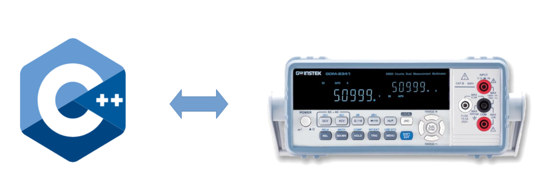

GWInstek Controller
=================
Overview
--------
<br>
<p align="center">
  
</p>
<br>

This is a C++-based package which is used for controlling GWInstek GDM-8341 Dual Measurement Multimeter. The package interacts with the device using a USB cable. The serial commands are based on the user manual kept in */doc* folder which is provided by the official website.

Usage
-----
- Please refer the sample script *main.cpp* located inside *sample/* folder. 

Setup
-----
###### To install
*1.* Clone or download this repository. Navigate into the folder's directory and run the below command.

## Build this with CMake and Visual Studio MSBuild 2019

```bash
mkdir build
cd build
cmake .. -G "Visual Studio 16 2019" -A Win32
cmake --build . --target ALL_BUILD --config Release
```

*Change the line "Win32" to "x64" if you are using DLLs which are based on 64-bit

## Running the tests

Either using `ctest`:
```bash
cd build
ctest
```

Or directly using `unit_tests` found inside `bin/Release`:
```bash
cd build/bin/Release
unit_tests
```

